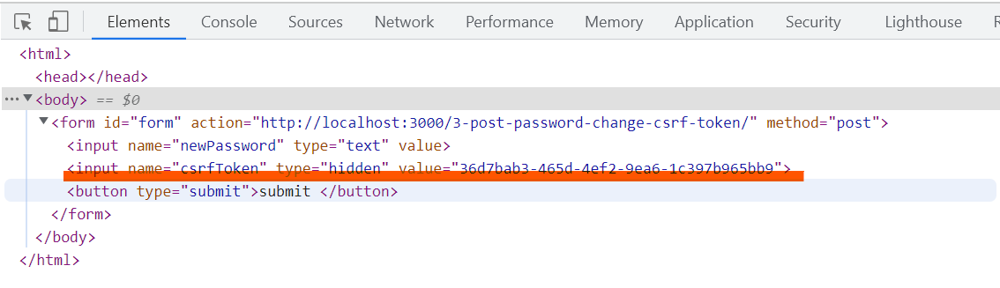

# 現状の汎用的な最適解防御

前章では、POST を使ったエンドポイントの防御までを実装し、それが容易に破られることを学びました。
この節では、現状で汎用的に使える、もっとも安全とされている防御手法を紹介します。

## 防御の方針

ここで一度 CWE の定義を思い出してみます。
英語版

> The web application does not, or can not, sufficiently verify whether a well-formed, valid, consistent request was intentionally provided by the user who submitted the request.
> https://jvndb.jvn.jp/ja/cwe/CWE-352.html

日本語版

> 本脆弱性が存在する Web アプリケーションは、フォーマットに沿った、妥当で一貫性のあるリクエストが、送信したユーザの意図通りに渡されたものかを十分に検証しない、あるいは検証が不可能です。
> https://cwe.mitre.org/data/definitions/352.html

CWE の定義によると、CSRF 脆弱性の原因について、ユーザーの意図通りに送信されたものかが「検証できない」ことだとされています。そのため、どうにかして正規のリクエストかどうかを検証することを考えます。

### 攻撃手法の整理

前章までの解説を踏まえて、エンドポイントは POST で実装しているとします。

そのような場合を考えると、攻撃者は一度自分が作成したウェブサイトを経由して攻撃を行う必要があります。ユーザーに POST メソッドを使ったリクエストを送信させるためには、HTML フォームの submit などを使うか、（後で説明する） を実行する必要があるからです。
また、ユーザーのブラウザ上で悪意のあるコードを実行させる必要があります。それは、cookie の sessionId を利用するためであったり、IP アドレスを偽装する必要があるからです。

### 防御手法の提案

「攻撃者は一度自分が作成したウェブサイトを経由して攻撃を行う」ことに注目します。

もし、リクエストが正規のサイト（運営者が構築したサイト）から送信されたものか、その他のウェブサイトから送信されたものかをサーバーアプリケーション側で検証できたとしたら、自分のサイトから送られたリクエスト以外を怪しいリクエストとして弾くことが可能なはずです。
言葉を変えれば、正規のサイトから送信されるリクエストに検証可能なもの（非正規のサイトからは送信できないもの）を紐づけることで、リクエストの検証を行えばいいのではないか、ということです。

## 防御の実装

「正規のサイトから送信されるリクエストに検証可能なもの（非正規のサイトからは送信できないもの）を紐づける」という方針で、現在もっとも安全で汎用的に使えるとされている、csrf token を使った実装方法を説明します。

## 実装の方針

フォームなどを含んだ HTML を送信するときに、csrf token と呼ばれる、ランダムな文字列を生成します。そして、それをサーバーサイドとクライアントサイドに保存します。
次に、クライアントからの POST リクエストに csrf token が含まれるようにして、サーバー側に保存してあったトークンと検証することで、正規のサイトからのリクエストかどうかを判定します。

攻撃者視点で考えてみましょう。
csrf token は、ユーザーがフォームのページに GET リクエストを出したときに毎回生成されるので、事前に知ることは不可能です。そのため、自分が用意する攻撃用のウェブサイトから、有効な csrf token を含んだリクエストを送信することができません。結果として、サーバー側のアプリケーションは、悪意のあるウェブサイトからのリクエストかどうかを判定することができます。

正確には、攻撃者が csrf token を知ることができるかもしれない方法があるのですが、それはブラウザの防御機構によって防がれています。このことについては [同一オリジンポリシー](/same-origin-policy.html) で後述します。

## 実装

上記のような方針を具体的に実装すると、以下のようになります。

```ts
router.get("/3-post-password-change-csrf-token", (_req, res) => {
  // csrf token を生成
  const csrfToken = crypto.randomUUID();
  //   サーバー側に csrf token を保存
  csrfTokens.push(csrfToken);
  //   form に csrf token を埋め込んだ HTML を送信
  res.send(`
    <form id="form" action="http://localhost:3000/3-post-password-change-csrf-token/" method="post">
    <input name="newPassword" type="text" value=""></input>
    <input name="csrfToken" type="hidden" value="${csrfToken}"></input>
    <button type="submit">submit</buttion>
    </form>
    `);
});

router.post("/3-post-password-change-csrf-token", (req, res) => {
  // sessionId を使ってログイン済みかどうかを検証
  const sessionId = req.cookies["sessionId"];
  // csrf token を取り出す
  const { newPassword, csrfToken } = req.body;
  if (!sessionId || !sessionIds[sessionId]) res.send("login required");
  else if (typeof newPassword !== "string" || typeof csrfToken !== "string")
    res.send("newPassword and csrfToken is required");
  // サーバー側に csrf token が保存されているかを検証
  else if (!csrfTokens.includes(csrfToken)) {
    console.log("attack detected!!!");
    res.send("you are attacker!!!");
  } else {
    const userName = sessionIds[sessionId].userName;
    changePassword(userName, newPassword);
    res.send("password changed!");
  }
});
```

二点解説を加えます。

```ts
csrfTokens.push(csrfToken);
```

これは、簡易的に csrf token をメモリの配列上に保存しています。本番環境では、DB に保存するほうがよいでしょう。
また、このアプリでは csrf token を削除していないので、本来であればその処理も必要です。

```html
<input name="csrfToken" type="hidden" value="${csrfToken}"></input>
```

これは、csrf token をフォームに埋め込んでいます。`type="hidden"`となっているため、ユーザーが見ているブラウザには描写されませんが、submit ボタンをおしたときに、新しいパスワードと一緒に送信されます。

## 実際の挙動

実際に動かして確認してみます。下のリンクにアクセスしてみましょう。
http://localhost:3000/3-post-password-change-csrf-token

すると、フォームが表示されるはずです。そのフォームを検証画面で見てみると、以下のように csrf-token が設定してあります。



## 防御の確認

攻撃用のウェブページを用意してみました。実装は以下の通りです。

```ts
app.get("/3-post-password-change-csrf-token", (_req, res) => {
  res.send(`
  <form id="form" action="${ORIGIN_BASE_URL}/3-post-password-change-csrf-token" method="post" style="display: none;">
  <input name="newPassword" type="text" value="aaaaaaa"></input>
  <input name="csrfToken" type="hidden" value="aaaaaaa"></input>
  <button type="submit">submit</buttion>
  </form>
  <script>
      const form = document.getElementById("form")
      form.submit()
  </script>
`);
});
```

しかし、csrf token がわからないため、とりあえず適当な値で埋めています。
このページにアクセスすると、パスワード変更の処理は実行されず、`console.log("attack detected!!!");`が実行されることがわかると思います。
http://localhost:4000/3-post-password-change-csrf-token
