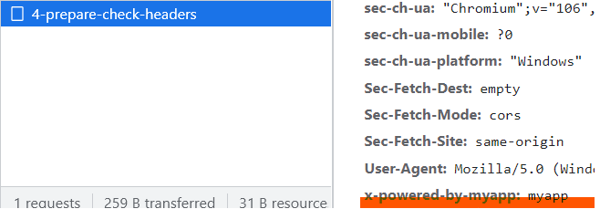
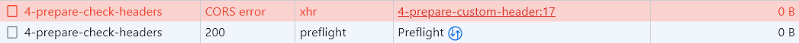

# どこから送信されたリクエストかを見る

この節では、リクエストが本当に正規のウェブサイトから送信されたのかを検証する方法として、送信元に紐づいた情報を確認してみます。そして、その危険性も確認します。

## Referer を確認する

HTTP ヘッダのひとつに `Referer`というヘッダがあります。このヘッダには、リクエストを送信したページの URL が格納されています。たとえば、http://example1.com/1 にある、http://example2.net/2 へのリンクをクリックしたときに、http://example2.net/2 へ GET リクエストが送られますが、そのリクエストの`Referer`ヘッダには、http://example1.com/1 という値が格納されています。

https://developer.mozilla.org/ja/docs/Web/HTTP/Headers/Referer

express では以下のようなコードで Referer を取得できます。

```ts
const referer = req.get("Referer");
```

この Referer を確認すれば、CSRF の防御になるでしょうか。Referer が完全に信頼できる値であった場合は、防御できるでしょう。しかし、いくつか懸念点があります。

一点目は、Referer を送信しないようにしているユーザーがいることです。開発者側からすれば、Referer を使えば、サイトの流入経路を分析できます。一方で、ユーザーからすれば、自分の見ていたサイトが第三者にわたる可能性があるので、プライバシーの問題があります。ユーザーがプライバシーのために Referer を送信しない設定をしていた場合、サイトを正常に動かすために Referer がないリクエストは検証せずに通すという対応が考えられますが、これでは CSRF の防御になりません。

Referer を CSRF の防御に使用することについては、RFC にも記述があり、Referer がすべてのリクエストに含まれているわけではないことが明示されています。

> Some servers use the Referer header field as a means of denying links from other sites (so-called "deep linking") or restricting cross-site request forgery (CSRF), but not all requests contain it.
> https://datatracker.ietf.org/doc/html/rfc7231#section-5.5.2

一方で、ユーザー側が無条件で Referer ヘッダを消すべきではないということも書いていますが、強制ではありません。

> An intermediary SHOULD NOT modify or delete the Referer header field when the field value shares the same scheme and host as the request target.
> https://datatracker.ietf.org/doc/html/rfc7231#section-5.5.2

二点目は、Referer が信頼できない可能性が、csrf token の方式に比べると相対的に高いということです。HTTP ヘッダに関する脆弱性などがあった場合に、攻撃者が有効な値を推測して攻撃を行うことができます。

## Origin を確認する

Origin は、HTTP ヘッダのひとつで、リクエストの送信元のスキームとドメイン名が含まれます。
https://developer.mozilla.org/ja/docs/Web/HTTP/Headers/Origin

このヘッダは、GET リクエストのときには送信されず、POST リクエストのときなどに送信されます。たとえば、http://example1.com/1 にある、http://example2.net/2 に submit するボタンをクリックしたときに、http://example2.net/2 へ POST リクエストが送られますが、そのリクエストの Origin には、http://example1.com という値が格納されています。

express では、以下のように Origin が取得できます。

```ts
const origin = req.get("Origin");
```

これを使えば、正規のサイトからのリクエストかどうかを検証できそうです。ただし、Referer と同じように認識しておくべきリスクや制約があります。

一点目は、有効な値が推測可能なため、HTTP ヘッダに関する脆弱性などがあった場合に、攻撃者が有効な値を推測して攻撃を行うことができるという点です。そして、実際にそのような脆弱性が次のブログで紹介されています。
https://blog.jxck.io/entries/2018-10-26/same-site-cookie.html#csrf

例に挙げられている脆弱性
https://insert-script.blogspot.jp/2018/05/adobe-reader-pdf-client-side-request.html

二点目は、サーバー側が自分の Origin を知っていなければいけないという制約です。これは、以下のブログで指摘されていた点ですが、自分はあまり具体的な事例が思いつきませんでした。
http://var.blog.jp/archives/86138542.html#Origin

## 独自ヘッダを入れる

これは、正規のサイトから送信されるリクエストに、開発者が定義した独自ヘッダを入れて、サーバー側で独自ヘッダを検証するという方法です。
なお、フォームでは独自ヘッダを送信することができないため、`HttpXMLRequest`や`fetch`などを使って、javascript でリクエストを送るときしか使えません。
具体的には、以下のようにします。

```ts
const req = new XMLHttpRequest();
req.open("POST", "http://localhost:3000/4-prepare-check-headers");
req.setRequestHeader("X-Powered-By-Myapp", "myapp");
req.send();
```

ここでは、`X-Powered-By-Myapp: myapp`という独自ヘッダをつけています。なお、`X-` という接頭辞は、独自ヘッダにつける慣習的なものだそうです。express では、デフォルトでレスポンスに`X-Powered-By: Express`というのがつきますね。

以下のページで検証画面を開いたあとに、submit ボタンを押して、独自ヘッダが送信されていることを確認しましょう。
http://localhost:3000/4-prepare-custom-header

以下のようになっていることが確認できると思います。


### 攻撃の検証

ここで、次のような疑問を感じる人もいると思います。クライアント側でヘッダをつけることができるのだから、攻撃者も`x-powered-by-myapp`というヘッダをつければいいのではないか。
実際に試してみましょう。

次のページに、先ほどアクセスしたサイトと同じページを用意しました。変わったのは、攻撃者がホスティングしているかどうか、つまりオリジンが違うかどうかです。
http://localhost:4000/4-prepare-custom-header

このページで、同じように submit ボタンを押すと、リクエストが失敗します。検証画面にはエラーが表示され、レスポンスも取得できていません。



### CORS という仕組み

このように、カスタムヘッダを使った防御への攻撃が失敗することがわかりました。では、なぜ失敗したのでしょうか。

ブラウザは、CORS (Cross-Origin Resource Sharing / オリジン間リソース共有) という仕組みを実装しています。この仕組みは、一般に SOP(Same-Origin Policy / 同一オリジンポリシー) によって実施されている、異なるオリジン間での通信制限を緩和するものです。
その仕組みの一つに、プリフライトリクエストというものがあります。これは、危険なリクエストを送る前に送信先のサーバーにブラウザがそのリクエストを送信してもいいかお伺いを立てるためのリクエストです。

先ほどの失敗したエラーの内容をコンソールでみると、以下のように書いてあります

> Access to XMLHttpRequest at 'http://localhost:3000/4-prepare-check-headers' from origin 'http://localhost:4000' has been blocked by CORS policy: Response to preflight request doesn't pass access control check: No 'Access-Control-Allow-Origin' header is present on the requested resource.

要約すると、「プリフライトリクエストで、http://localhost:3000/4-prepare-check-headers からリクエストを送っていいかどうかを http://localhost:4000 に聞いたけど、ダメらしいから失敗させたよ」という感じです。

プリフライトリクエストは、異なるオリジン間での通信で、特定の条件が満たされたときにだけ発行されます。今回の場合は、「POST であり、独自ヘッダがついていた」ため、プリフライトリクエストが送信されました。もしカスタムヘッダがついていなかったら、プリフライトリクエストは送信されません。

### 独自ヘッダのまとめ

以上のことから、基本的には独自ヘッダを用いた検証は効力を発揮します。一方で、制限やリスクがあるのも事実です。
まず制限としては、カスタムヘッダを送信するためには javascript を使う必要があるということです。フォームを使った場合の CSRF 対策には使えません。
次にリスクとしては、HTTP ヘッダの脆弱性が存在した場合、無力になるということです。これは、Referer や Origin と同じです。

### CORS について

ここで紹介している CORS は、今回の説明に必要最低限なものです。時間のあるときに下記の資料を読んでおくことをおすすめします。

同一オリジンポリシー - ウェブセキュリティ | MDN
https://developer.mozilla.org/ja/docs/Web/Security/Same-origin_policy

オリジン間リソース共有 (CORS) - HTTP | MDN
https://developer.mozilla.org/ja/docs/Web/HTTP/CORS

また、歴史や周辺知識も含めてさらに詳しく知りたいという方には、下記の書籍がおすすめです。

『Web ブラウザセキュリティ ― Web アプリケーションの安全性を支える仕組みを整理する』米内貴志 著
https://www.lambdanote.com/collections/wbs

## フェッチメタデータリクエストヘッダをみる

フェッチメタデータリクエストヘッダとは、`Sec-`という接頭辞がつく HTTP ヘッダの総称です。
このヘッダには、リクエストの発信元に関する情報が含まれていて、正規のリクエストかどうかの検証などに利用できます。これらのヘッダは、対応しているブラウザであれば自動で送信されます。
https://developer.mozilla.org/ja/docs/Glossary/Fetch_metadata_request_header

特に CSRF の文脈では、`Sec-Fetch-Site`が重要です。このヘッダには、送信元と送信先のオリジンの関係によって、`cross-site`や`same-origin`などが格納されます。
https://developer.mozilla.org/en-US/docs/Web/HTTP/Headers/Sec-Fetch-Site

この方法も、ヘッダに関する脆弱性が存在した場合のリスクが存在します。
また、2022/10/13 現在では、safari においてこの機能がサポートされていません。
https://caniuse.com/?search=Sec-Fetch-Site

W3C のドラフトには入っているため、Safari でサポートされたら使えるようになるでしょう。
https://w3c.github.io/webappsec-fetch-metadata/#framework

## 実際に確認する

次のリンクから、POST リクエストを送信して、実際の挙動を確認してみましょう
http://localhost:3000/4-prepare-custom-header

サーバー側のログに、各種ヘッダが出力されていると思います。
なお、 http://localhost:4000 からリクエストを送った場合は、`Sec-Fetch-Site`の値が`cross-site`ではなく、`same-site`になることに注意してください。ポート番号のみが違う場合は、`same-site`になります。
