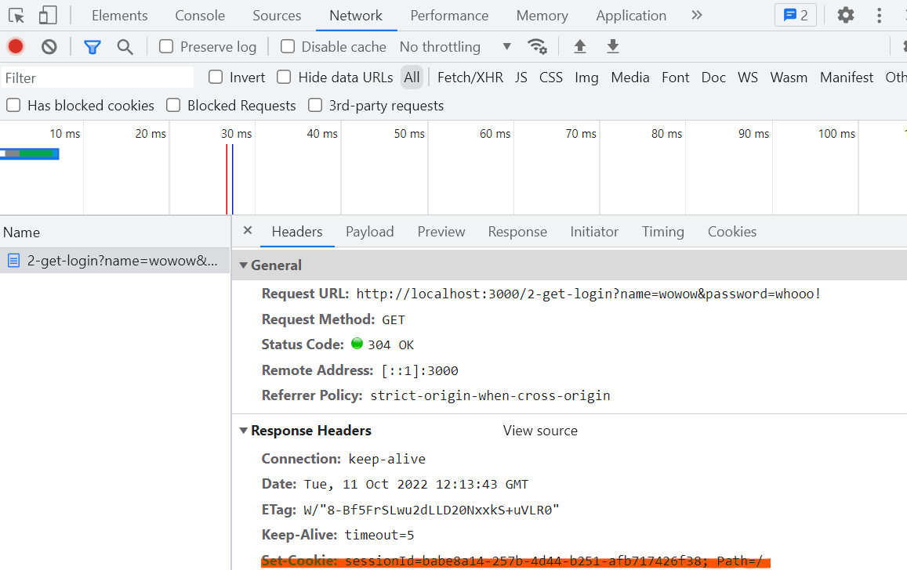

# ログイン認証をさせてみる

前節では、リンクをクリックするだけで、容易に CSRF 攻撃をされてしまうことを説明しました。
では、例えばログイン認証などの機能を入れれば問題なかったのでしょうか？

この節では、一般的にログイン認証として使われている cookie を使った認証機構を、GET リクエストを使って実装します。そして、GET リクエストを使っているとログイン認証があっても、依然として CSRF 脆弱性があることを説明します。

## サンプルアプリの説明

### cookie とはなにか

> サーバーがユーザーのウェブブラウザーに送信する小さなデータであり、ブラウザーに保存され、その後のリクエストと共に同じサーバーへ返送されます。一般的には、 2 つのリクエストが同じブラウザーから送信されたものであるかを知るために使用されます。
> https://developer.mozilla.org/ja/docs/Web/HTTP/Cookies

cookie は、HTTP ヘッダの一種です。
サーバーからクライアントにレスポンスを返すときに、サーバー側のアプリケーションは必要に応じて、`Set-Cookie`ヘッダをレスポンスに付与します。

`Set-Cookie`ヘッダを含むレスポンスを受け取ったクライアント（基本的にはブラウザ）は、クライアント側の端末に cookie を保存します。cookie は、`name=value` という形式をもち、文字列として保存されます。

### cookie を使ったログイン認証

↓ の記事の説明がとてもわかりやすいです。

4 歳娘「パパ、セッションと Cookie ってなあに？」
https://qiita.com/Yametaro/items/9b65a21940e001554719

### サンプルアプリの正常系

#### ログインの流れ

実際にサンプルアプリで試してみます。

まずは、以下の URL にアクセスして、`login required`という表示がされることを確認してください

http://localhost:3000/2-get-confirm

次に以下のリンクにアクセスすると、`logined!`という表示が出ると思います。以下のリンクには、name と password というクエリパラメタが含まれています。

http://localhost:3000/2-get-login?name=wowow&password=whooo!

その後、再度以下のリンクにアクセスしてみると、ログインしていることが確認できると思います

http://localhost:3000/2-get-confirm

#### 実装の説明

実装をみながら説明していきます。
`/2-get-confirm` の URL にアクセスすると、`/originHandler/2-password-change.ts`ファイルの 8 行目にある、以下のような処理が開始されます。

```ts
// /2-get-login に GET リクエストがきたら、この関数が処理を受け持つ
router.get("/2-get-login", (req, res) => {
  // name, password の値を URL クエリから取り出す
  const { name, password } = req.query;
  // name, password が存在するかを確かめる
  if (typeof name !== "string" || typeof password !== "string") {
    res.send("query: name and password is required");
    return;
  }

  // 正しい name と password かどうかを検証する
  if (users[name] && users[name].password === password) {
    // ランダムな sessionId を生成する
    const sessionId = crypto.randomUUID();
    // sessionId をサーバー側に保存する
    sessionIds[sessionId] = {
      userName: name,
    };
    console.log(`registered sessionId ${sessionId} for user ${name}`);
    // sessionId をクライアントに保存するために、 Set-Cookie ヘッダを追加する
    res.cookie("sessionId", sessionId);
    // レスポンスを返す
    res.send("logined!");
  } else {
    res.send("name or password is incorrect");
  }
});
```

また、`users`オブジェクトは、以下のようなデータで初期化されています

```ts
const users: Users = {
  wowow: {
    password: "whooo!",
  },
};
```

上記の処理が行われた結果、あなたのクライアントに sessionId の cookie が保存されます。実際に保存されたかどうかを見てみましょう。
以下、chrome で cookie を確認します。
`logined!`が出ている画面で検証ツールを開いてください（右クリックのメニューから「検証」をクリックしてください）
次に、application タブを開き、cookie から、localhost:3000 を選択してください。すると、`sessionId`の欄に、生成された sessionId が確認できるでしょう。


そのまま、検証画面上で network タブを開いてください。
そして、以下のページを再読み込みすると、ネットワークでやりとりされているファイルがみられると思います。

http://localhost:3000/2-get-login?name=wowow&password=whooo!

その中から document の 2-get-login を開いてみましょう。request と response のそれぞれの HTTP ヘッダが確認できると思います。response のなかに、`Set-Cookie`ヘッダがあることを確認しましょう。


また、以下のリンクを踏むと、request に `Cookie`ヘッダが含まれていることが、同様に network タブから確認できます。

http://localhost:3000//2-get-confirm


#### パスワード変更の正常系

ログインした状態で、以下のリンクにアクセスすると、パスワード変更が可能です。クエリパラメタの`newPassword`の値を好きなものに書き換えてください。
http://localhost:3000/2-get-password-change?newPassword=yourNewPassword

ログインした状態であれば、`changePassword`関数が実行され、パスワードが変更されるはずです。

実装を確認してみましょう。

```ts
// 2-get-password-change というパスに GET リクエストがきたら処理する
router.get("/2-get-password-change", (req, res) => {
  // cookie から sessionId を取り出す
  const sessionId = req.cookies["sessionId"];
  // クエリパラメタから newPassword を取り出す
  const newPassword = req.query.newPassword;

  // sessionId を確認し、ログイン済みかどうかを確かめる
  if (!sessionId || !sessionIds[sessionId]) res.send("login required");
  // passward を変更する
  else if (typeof newPassword !== "string") res.send("newPassword is required");
  else {
    const userName = sessionIds[sessionId].userName;
    changePassword(userName, newPassword);
    res.send("password changed!");
  }
});
```

## CSRF を試してみる

以上のような実装をしている場合の CSRF 脆弱性について確認します。
ある日、以下のようなメールが送られてきて、リンクをクリックしたとします。

<<<<<<<<<<<<<<<<

おめでとうございます！抽選に当選しました！！以下のリンクから景品を選んでください！！！！

[当選品選択ページ](http://localhost:3000/2-get-password-change?newPassword=evilPassword)

<<<<<<<<<<<<<<<<

このとき、ログインした状態であれば、localhost:3000 に sessionId を含んだ cookie が送信されます。すると、サーバー側は既にログイン済みとして、パスワード変更の処理を実行してしまい、あなたのアカウントのパスポートが`evilPassword`に変更されてしまいます。

今回であれば、リンクは次のようなものだったので、パスワードが evilPassward になってしまうということですね。
http://localhost:3000/2-get-password-change?newPassword=evilPassword

ほかにも、たとえば掲示板サービスの投稿用 API のリンクであれば、不適切な発現を投稿してしまうかもしれません。

### CSRF が起きた原因

このような挙動は、cookie が送信される条件に注目すると理解できます。
cookie を送信するかどうかは、cookie を発行したドメインであれば自動で送信することになっています。逆に言えば、送信元がどのウェブサイトであっても（攻撃者のウェブサイトであっても、悪意のあるリンクによる遷移だとしても）、送信先が一致すれば cookie は送られるということです。
この挙動は、ユーザーの利便性のためには欠かせないものです。もしドメインをまたいだリクエストのときに cookie が送信されないと、ほかページのリンクから遷移するごとに毎回認証が必要になってしまいます。
たとえば、もし twitter へのリンクがこのウェブサイト上にあったとして、リンクをクリックすると twitter の画面にログイン済みの状態で遷移することを期待すると思います。ログイン済みの状態でなければ、いいねなどができないですしね。しかし、異なるドメインのサイトなので、cookie が送信されず、ログイン状態にならないといった事態が起こるでしょう。（これは twitter が cookie でログイン状態を管理していた
場合の話です）

今回であれば、localhost:3000 に紐づけられている cookie が存在したので、localhost:3000 宛てのリクエストを送るときにその cookie を含んだリクエストを作ったということです。
